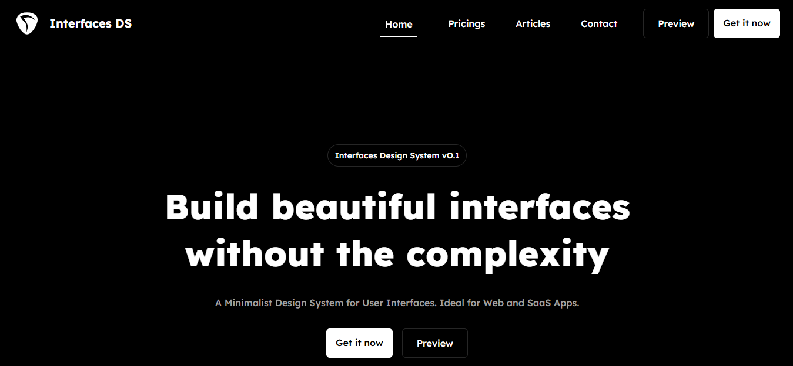
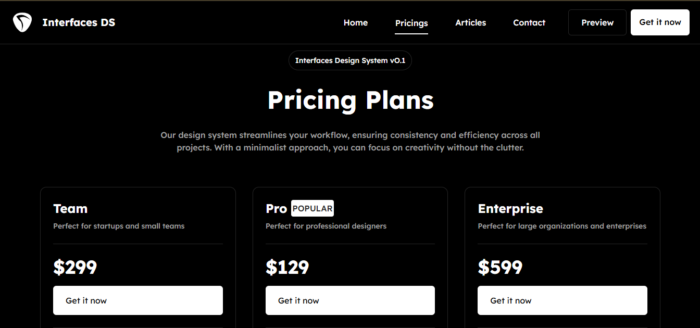
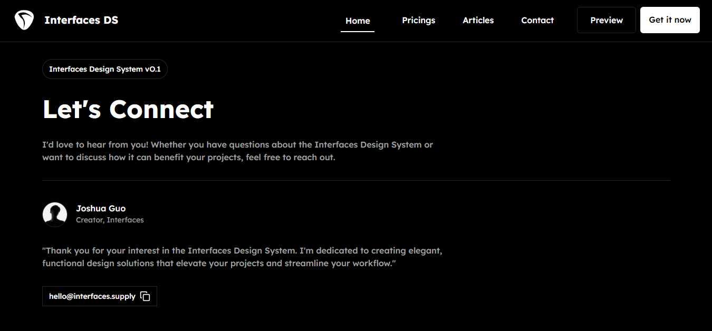

# Interfaces DS Landing Page

 

A conceptual landing page for **Interfaces Design System (v0.1)** – a minimalist UI design system imagined for building beautiful, efficient web and SaaS interfaces without unnecessary complexity.

**Note:** This is a **fictional product concept**. The landing page serves as a portfolio project to demonstrate marketing site design, UI storytelling, and front-end craftsmanship. The actual design system product does not exist – it's purely an idea showcased through this site!

**Live Demo:**[interfacesds.netlify.app]

## Overview

Interfaces DS promotes a "less is more" philosophy with clean grids, modular components, and seamless design-to-code potential. The page includes:

- **Hero Section**: Bold messaging on building elegant interfaces quickly.
- **Dashboard Preview**: Mockup of a dark-mode admin dashboard with charts, metrics, and sidebar navigation.
- **Features**: Sections on minimalist modular design, workflow efficiency, customization, and flexibility.
- **Testimonials**: Placeholder reviews (with one fun fake quote).
- **Pricing Plans**: Three tiers – Team ($299), Pro ($129, marked popular), Enterprise ($599).
- **Contact & Footer**: Creator bio (Joshua Guo-inspired), newsletter signup, and quick links.
- **Articles Teaser**: Blog-style page with a sample post on the design system journey.

Deployed at: https://interfaceds.netlify.app (concept only – some sections like Articles may be minimal or placeholder).

## Tech Stack

- HTML5 / CSS3 (with utility-first styling using Tailwind CSS and custom classes)
- JavaScript (React for interactivity)
- Hosted on Netlify for fast deployment

## Purpose & Learnings

This project was created to:
- Practice product landing page design and copywriting.
- Explore dark-mode aesthetics and data visualization mockups.
- Build a cohesive brand identity for a hypothetical premium tool.

It highlights skills in responsive design, user persuasion, and creating hype around an idea.

## Screenshots





## Setup (If Cloning)

```bash
git clone https://github.com/TaslimYusuf2210/Interfaceds.git
cd interfaces-ds-landing
# Open index.html in browser or deploy to Vercel/Netlify